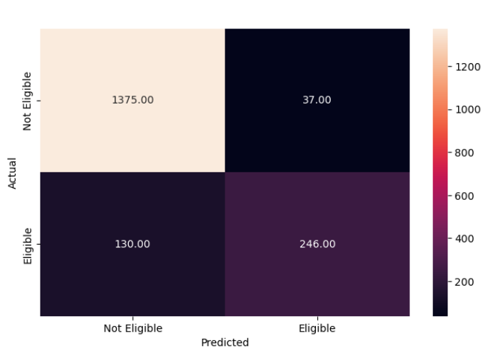

# Loan Predictor
The bank loan predictor is a machine learning tool designed to assist in predicting clients who are likely to default on their loan. 
## Overview
A major proportion of retail bank profit comes from interests in the form of home loans. These loans are borrowed
by regular income/high earning customers. Banks are most fearful of defaulters, as bad loans (NPA) usually eat
up a major chunk of their profits. Therefore, it is important for banks to be judicious while approving loans for
their customer base.
The approval process for the loans is multifaceted. Through this process, the bank tries to check the
creditworthiness of the applicant on the basis of a manual study of various aspects of the application. The entire
process is not only effort-intensive but also prone to wrong judgment/approval owing to human error and biases.
There have been attempts by many banks to automate this process by using heuristics. But with the advent of
data science and machine learning, the focus has shifted to building machines that can learn this approval process
and make it free of biases and more efficient. At the same time, one important thing to keep in mind is to make
sure that the machine does not learn the biases that previously crept in because of the human approval process.

## Problem Statement
A bank's consumer credit department aims to simplify the decision-making process for home equity lines of credit
to be accepted. To do this, they will adopt the Equal Credit Opportunity Act's guidelines to establish an empirically
derived and statistically sound model for credit scoring. The model will be based on the data obtained via the
existing loan underwriting process from recent applicants who have been given credit. The model will be built
from predictive modeling techniques, but the model created must be interpretable enough to provide a
justification for any adverse behavior (rejections).

## Usage
To start the app, simply run the following command:

#### streamlit run predict.py 
This will launch the app in your default browser. You can then input the figures, and click the button to view the result. 

# Exploratory Data Analysis / Prediction

